# 🚀 LocalSQLAgent - 本地化智能Text-to-SQL代理系统

[](https://github.com/tokligence/LocalSQLAgent)
[](https://github.com/tokligence/LocalSQLAgent)
[](https://github.com/tokligence/LocalSQLAgent)
[](https://ollama.com)
[](https://www.python.org/downloads/)

> 🎯 **多次尝试可提升稳定性，但提升幅度因数据而异** — 真实效果请以你的基准测试为准。

[中文文档](README_CN.md) | [English](README.md)

## 🏗️ 部署架构对比

### ❌ 传统Cloud方案（昂贵、隐私风险）
```
┌─────────────┐     ┌──────────────────────┐     ┌─────────────┐
│   用户输入   │────▶│  发送到云端API ($$$)  │────▶│  云端GPT-4   │
│  "查询..."   │     │   数据离开本地 ⚠️     │     │  Claude API  │
└─────────────┘     └──────────────────────┘     └─────────────┘
                               │                          │
                               ▼                          ▼
                    ┌──────────────────┐      ┌──────────────────┐
                    │  数据暴露风险 ⚠️  │      │ 月费$200-2000 💸 │
                    └──────────────────┘      └──────────────────┘
```

### ✅ LocalSQLAgent方案（免费、隐私、高效）
```
┌──────────────────────────────────────────────────────────────────────┐
│                        🏠 100% 本地部署环境                           │
│                                                                      │
│  ┌────────────┐     ┌─────────────────┐     ┌──────────────────┐   │
│  │  用户输入   │────▶│  LocalSQLAgent  │────▶│  Ollama本地模型   │   │
│  │  "查询..."  │     │   智能Agent      │     │ Qwen2.5-Coder:7B │   │
│  └────────────┘     └─────────────────┘     └──────────────────┘   │
│                              │                         │             │
│                              ▼                         ▼             │
│                    ┌──────────────────┐     ┌──────────────────┐   │
│                    │  模糊检测模块     │     │  多次尝试策略     │   │
│                    │  误报率可调       │     │  显著提升准确率   │   │
│                    └──────────────────┘     └──────────────────┘   │
│                              │                         │             │
│                              └────────┬────────────────┘             │
│                                       ▼                              │
│                           ┌──────────────────────┐                   │
│                           │   动态Schema发现      │                   │
│                           │  (实时数据库分析)     │                   │
│                           └──────────────────────┘                   │
│                                       │                              │
│                                       ▼                              │
│     ┌──────────────────────────────────────────────────────┐        │
│     │              本地数据库 (数据不离开本地)               │        │
│     │  PostgreSQL │ MySQL │ MongoDB │ ClickHouse │ SQLite  │        │
│     └──────────────────────────────────────────────────────┘        │
│                                                                      │
│  优势：💰 $0成本  🔒 100%隐私  ⚡ 1-3秒/次  📈 多次尝试提升         │
└──────────────────────────────────────────────────────────────────────┘
```

## 🔄 系统工作流程

```mermaid
graph LR
    A[自然语言查询] --> B{模糊检测}
    B -->|清晰| C[Schema发现]
    B -->|模糊| D[请求澄清]
    D --> C
    C --> E[SQL生成]
    E --> F{执行SQL}
    F -->|成功| G[返回结果]
    F -->|失败| H[错误学习]
    H --> I[调整策略]
    I --> E

    style A fill:#e1f5fe
    style G fill:#c8e6c9
    style B fill:#fff9c4
    style H fill:#ffccbc
```



## 📊 核心成果

### 🚀 多次尝试策略效果（真实基准）
数据集：Spider dev（前100条）。模型：`qwen2.5-coder:7b`（Ollama）。成功即停止。温度：1次=0.0，5/7次=0.2。

**本机（venv）**
| 最大尝试次数 | 执行准确率 | 精确匹配 | 平均耗时 | 平均尝试次数 |
|-------------|-----------|---------|---------|-------------|
| 1次 | 84% | 3% | 2.43s | 1.00 |
| 5次 | 85% | 4% | 3.97s | 1.66 |
| 7次 | 85% | 4% | 4.79s | 1.94 |

**Docker（本地镜像标签 `localsqlagent-api`）**
| 最大尝试次数 | 执行准确率 | 精确匹配 | 平均耗时 | 平均尝试次数 |
|-------------|-----------|---------|---------|-------------|
| 1次 | 84% | 3% | 2.56s | 1.00 |
| 5次 | 84% | 2% | 4.22s | 1.66 |
| 7次 | 84% | 3% | 4.77s | 1.96 |

**关键发现**：在该子集中，多次尝试仅带来轻微提升（84% → 85%），但耗时增加明显。

**BIRD dev**：`bird-bench.oss-cn-beijing.aliyuncs.com/dev.zip` 在当前环境下载失败，Hugging Face 的 mini-dev 不含 SQLite 数据库/Schema，无法执行评测。请将完整 BIRD dev 数据放入 `data/bird` 后再运行 `--benchmark bird`。

复现（Spider dev 子集）：
```bash
python benchmarks/sql_benchmark.py --model ollama --model-name qwen2.5-coder:7b \
  --benchmark spider --limit 100 --max-attempts 5 --temperature 0.2
```

### ✅ 集成测试（Live Services）
运行：
```bash
pytest tests/integration/test_schema_discovery_mysql_clickhouse.py \
  tests/integration/test_multi_statement_execution.py \
  tests/integration/test_multi_schema_postgres.py \
  tests/integration/test_live_services_smoke.py -q
```
最新一次运行（macOS，本地Docker，2026-01-16）：`7 passed`。

### 多数据库基准（需自行运行）
PostgreSQL/MySQL/ClickHouse/MongoDB 的准确率受 schema、数据分布与模型版本影响较大。请结合你的数据运行集成测试与基准脚本。

## 💡 为什么选择本地部署？

### 🆚 成本对比（月度）
| 解决方案 | API成本 | 服务器成本 | 总成本 | 数据隐私 |
|----------|---------|-----------|--------|----------|
| **LocalSQLAgent** | **$0** | **$0** | **$0** ✅ | **100%本地** 🔒 |
| GPT-4 API | $200-2000 | $0 | $200-2000 | 数据上传云端 ⚠️ |
| Claude API | $150-1500 | $0 | $150-1500 | 数据上传云端 ⚠️ |
| 自建GPT | $0 | $5000+ (A100) | $5000+ | 需要专业运维 |

### 🚀 性能对比（实测：Spider dev 前100条）
```
硬件需求：普通笔记本电脑（8GB RAM）
模型大小：7B参数（4GB磁盘空间）
响应时间：每次尝试1-3秒

多次尝试策略的准确率提升：
• 1次尝试：执行准确率84%
• 5次尝试：执行准确率85%
• 7次尝试：执行准确率85%
• 时间权衡：平均耗时约2.4s → 4.8s

并发支持：10+ QPS
```

### 🔒 企业级优势
- ✅ **数据合规** - GDPR/HIPAA完全合规，数据不出企业网络
- ✅ **离线可用** - 无需互联网连接，适合高安全环境
- ✅ **成本可控** - 一次部署，永久使用，无订阅费用
- ✅ **定制自由** - 可针对业务场景微调模型

## 🚀 快速开始（2分钟本地部署）

### ⚡ 使用Makefile一键启动（推荐）
```bash
# 1. 克隆项目
git clone https://github.com/tokligence/LocalSQLAgent.git
cd LocalSQLAgent

# 2. 一键安装和启动
make start        # 自动安装Ollama、下载模型、启动数据库
make quick-start  # 运行演示

# 其他有用命令
make help         # 查看所有可用命令
make benchmark    # 运行完整基准测试
make clean        # 清理所有容器和数据
```

### 🛠️ 手动安装（如需自定义）
```bash
# 1. 安装Ollama
curl -fsSL https://ollama.com/install.sh | sh

# 2. 下载模型（仅需4GB，一次下载永久使用）
ollama pull qwen2.5-coder:7b

# 3. 启动数据库（可选）
docker-compose up -d

# 4. 安装依赖并运行
pip install -r requirements.txt
python quick_start.py
```

**就这么简单！** 无需API密钥，无需云服务，无需信用卡 🎉

### 🎯 立即体验
```python
# quick_start.py 会自动演示：
>>> 查询: "查询所有VIP客户的订单"
✅ 检测到模糊: 'VIP客户' 需要澄清
   建议: ['年消费>10000', '会员等级=VIP', '近期高频客户']

>>> 查询: "统计2024年1月的销售额"
✅ 查询明确，生成SQL中...
SELECT SUM(amount) FROM orders WHERE date >= '2024-01-01' AND date < '2024-02-01'
⚡ 执行时间: 1.2秒 | 💰 API成本: $0.00
```

### 📦 完整部署（包含数据库）
```bash
# 如需测试真实数据库（可选）
docker-compose up -d  # 启动PostgreSQL, MySQL, MongoDB等

# 运行完整基准测试
python benchmarks/sql_benchmark.py --model ollama:qwen2.5-coder:7b
```

## 🏗️ 项目架构

```
text2sql2026/
├── src/                        # 核心源代码
│   ├── core/                   # 核心模块
│   │   ├── ambiguity_detection.py    # 模糊查询检测
│   │   ├── intelligent_agent.py      # 智能Agent
│   │   └── schema_discovery.py       # Schema发现
│   ├── agents/                 # Agent实现
│   └── mongodb/                # MongoDB专用
├── benchmarks/                 # 基准测试
├── examples/                   # 示例代码
├── tests/                      # 测试套件
└── docs/                       # 文档
```

## 💡 核心特性

### 1. 动态Schema发现
- **自动发现数据库结构** - 无需硬编码Schema
- **字段含义推断** - 基于字段名和样本数据
- **关系发现** - 自动识别表间关系

### 2. 模糊查询处理
- **智能识别模糊表达** - "最近"、"热门"等
- **误报率控制** - 多层验证机制，需按业务调参
- **交互式澄清** - 主动询问用户意图

### 3. 多策略执行
- **自适应策略选择** - 根据查询复杂度选择最优策略
- **错误恢复机制** - 多次尝试，从错误中学习
- **缓存优化** - 智能缓存提升响应速度

### 4. UI 与安全策略
- **Schema预览** - “Explore the database” 直接展示结构卡片
- **多库选择** - UI支持一次选多个数据库并对比结果
- **安全开关** - 默认只读 + LIMIT 防护，可开启DDL/DML
- **Schema控制** - 可配置样本/行数与schema过滤

### 入口说明
- `web/api_server.py` — OpenAI兼容API（生产入口）
- `web/app.py` — Streamlit UI（交互入口）

### 5. MCP集成（可选）
- **统一接口** - 支持多数据源
- **实时Schema更新** - 动态获取最新结构
- **性能优化** - 缓存和批处理
- **说明** - MCP服务端不随仓库提供，需自行部署

## 📈 性能对比

### 关键发现（以你的基准为准）
1. **模型选择影响巨大** - 需在你的数据上对比不同模型
2. **Schema质量是核心前提** - 动态Schema与清晰字段命名显著提升稳定性
3. **查询明确度决定成功率** - 需要澄清机制或前置约束

### 改进建议
- SQL查询：结合真实业务数据持续回归测试
- MongoDB/复杂查询：建议引入模板或规则辅助

## 📚 文档

- [研究报告](docs/research/) - 模型评测和技术调研
- [分析报告](docs/analysis/) - MongoDB测试分析、误报分析等
- [API文档](docs/api/) - 接口说明（开发中）

## 🛠️ 高级用法

### 生产环境部署

```python
from src.core.intelligent_agent import IntelligentSQLAgent

# 初始化Agent
agent = IntelligentSQLAgent(
    model_name="qwen2.5-coder:7b",
    db_config={"type": "postgresql", ...},
    mcp_server="http://localhost:8080"  # 可选
)

# 执行查询
result = agent.execute_query("找出最近购买的VIP客户")
```

### 自定义配置

```python
# 调整模糊检测阈值
detector = AmbiguityDetector(confidence_threshold=0.8)

# 使用更多重试次数
agent = IntelligentSQLAgent(
    model_name="qwen2.5-coder:7b",
    db_config={"type": "postgresql", ...},
    max_attempts=7
)
```

## 🔧 配置选项

| 参数 | 默认值 | 说明 |
|------|--------|------|
| `model_name` | qwen2.5-coder:7b | LLM模型 |
| `max_attempts` | 5 | 最大重试次数 |
| `confidence_threshold` | 0.75 | 模糊检测阈值 |
| `cache_ttl` | 3600 | 缓存过期时间(秒) |

LLM 温度/最大 tokens 可在 `~/.tokligence/llm_config.json` 或环境变量（如 `OLLAMA_TEMPERATURE`）中设置；`schema_options` 可通过 API 或 UI 配置。

## 🌟 与Ollama生态完美集成

LocalSQLAgent是Ollama生态系统的原生应用：
```bash
# 支持所有Ollama模型
ollama pull qwen2.5-coder:7b      # 推荐：最佳效果
ollama pull deepseek-coder:6.7b   # 备选：也很不错
ollama pull sqlcoder:7b            # 专用：SQL专门模型

# 一行代码切换模型
python benchmarks/sql_benchmark.py --model ollama:deepseek-coder:6.7b
```

## 🎯 核心创新点

1. **🧠 智能Agent策略** - 不只是单次生成，而是像人类一样多次尝试和学习
2. **🔍 模糊检测** - 业界首个集成模糊查询检测的Text2SQL系统
3. **📊 动态Schema** - 实时分析数据库结构，无需手动配置
4. **🏠 纯本地运行** - 使用Ollama实现完全本地化部署
5. **💰 零成本运营** - 无任何API调用费用，一次部署永久使用

## 📈 核心优势

- **零成本运行** - 使用Ollama本地模型，无需支付API费用
- **数据隐私保护** - 所有数据处理都在本地完成，适合敏感数据场景
- **离线可用** - 不依赖互联网连接，可在隔离环境运行
- **快速响应** - 本地推理延迟低，1-3秒即可生成SQL


## 🤝 贡献

欢迎提交Issue和Pull Request！特别欢迎：
- 新数据库适配器
- 更多Ollama模型测试
- 企业级功能需求
- 性能优化建议
- 文档改进

## 📄 许可证

MIT License - 详见 [LICENSE](LICENSE)

## 🙏 致谢

- **Ollama团队** - 提供优秀的本地模型部署方案
- **Qwen团队** - Qwen2.5-Coder模型效果卓越
- **开源社区** - 感谢所有贡献者

---

<div align="center">

### 🏢 由 [Tokligence](https://github.com/tokligence) 开发
*为本地AI生态系统构建智能工具*

🌟 **如果这个项目对你有帮助，请给我们一个Star！**

</div>

**标签**: #text-to-sql #ollama #local-llm #qwen-coder #zero-cost #privacy-first #sql-agent #mongodb
